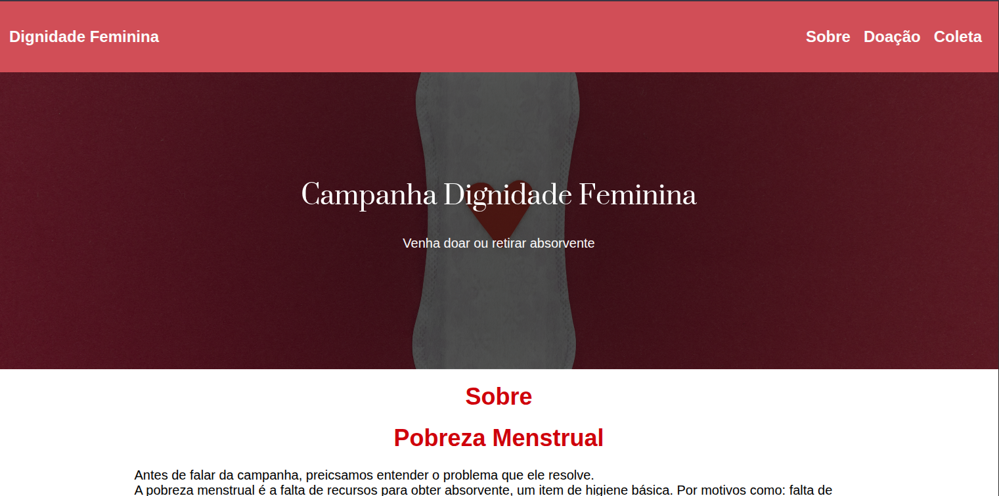

# Dignidade Feminina
O Dignidade Feminina é um projeto desenvolvido para conscientizar e incentivar a doação de absorventes. A plataforma apresenta dados relevantes sobre a dignidade menstrual, além de mapear os principais pontos de coleta e doação.

## 🚀 O que aprendi

- Otimização de SEO: Implementação e estruturação técnica de metatags.
- Estilização padronizada: Organização e consistência visual utilizando Sass e arquitetura de componentes.
- Manipulação de dados: Consumo e renderização de dados externos e dinâmicos através de arquivos JSON e do método .map().
- Acessibilidade aplicada: Inclusão de recursos práticos como ampliação da área de hiperlinks, feedbacks visuais no hover, ajuste no tamanho das fontes e textos otimizados para leitores de tela (atributos ARIA).

## 💡 Próximos passos (O que pode melhorar)

- Refinar a estilização dos dados sobre dignidade menstrual para dar maior destaque visual às estatísticas.
- Implementar suporte a tema claro e escuro (Light/Dark Mode) para ampliar a acessibilidade.
- Dar maior visibilidade à identidade visual do CAMPB (instituição criadora da campanha).

## 🛠️ Tecnologias utilizadas

- React.js
- Sass
